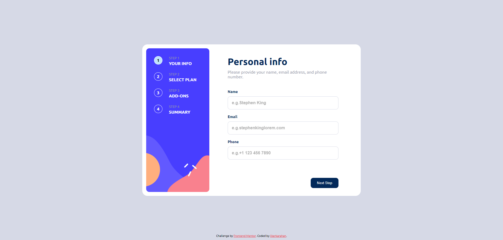

# Frontend Mentor - Multi step form solution

This is a solution to the [Multi step form solutionchallenge on Frontend Mentor](https://www.frontendmentor.io/challenges/multistep-form-YVAnSdqQBJ). Frontend Mentor challenges help you improve your coding skills by building realistic projects. 

## Table of contents

- [Frontend Mentor - Multi step form solution](#frontend-mentor---multi-step-form-solution)
  - [Table of contents](#table-of-contents)
  - [Overview](#overview)
    - [Screenshot](#screenshot)
    - [Links](#links)
    - [Built with](#built-with)
  - [Author](#author)

## Overview

### Screenshot

### Links

- Solution URL: [Frontend Mentor](https://www.frontendmentor.io/solutions/multi-step-form-solution-7yuEer-vUz)

### Built with

- Semantic HTML5 markup
- CSS 
- Flexbox
- Mobile-first workflow
- [Google Fonts](https://fonts.google.com) - Google Fonts
- JavaScript dom
- JavaScript form validation

## Author

- Website - [ilkerkarahan](https://ilkerkarahan.com)
- Frontend Mentor - [@ilkerkarahan](https://www.frontendmentor.io/profile/ilkerkarahan)
